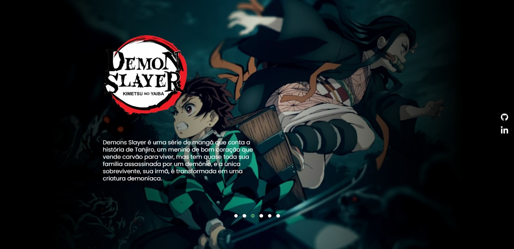

<h1 align="center">⚔Demon_slayer_project⚔</h1>

Repositório onde apresentarei a customização do site construido durante a <strong>Semana do zero ao programador</strong> oferecida pelo canal <a href="https://www.youtube.com/@DevemDobro">Dev em Dobro</a>!

  <a href="#-tecnologias">Tecnologias</a>&nbsp;&nbsp;&nbsp;|&nbsp;&nbsp;&nbsp;
  <a href="#-projeto">Projeto</a>&nbsp;&nbsp;&nbsp;|&nbsp;&nbsp;&nbsp;
  <a href="#-veja o projeto ">Veja o projeto</a>
 

  

>🟢 Projeto finalizado

> <strong>Deixa uma estrelinha?🙏⭐</strong>

## 👩‍💻 Tecnologias

Esse projeto foi desenvolvido com as seguintes tecnologias:

- HTML
- CSS
- JavaScript
- Visual Studio Code
- Git e Github

 

## 💻 Projeto

Site com o tema do Anime Kimetsu no Yaiba desenvolvido graças a <strong>Semana do zero ao programador</strong> oferecida pelo canal <a href="https://www.youtube.com/@DevemDobro">Dev em Dobro</a>!

<video width="100%" autoplay controls>
  <source src="./src/video/video.webm" type="video/webm">
Your browser does not support the video tag.
</video>

 

## 👀 Veja o projeto

<a href="https://kaysilvha.github.io/demon_slayer_project/">Clique aqui</a> para conferir o projeto completo e com todas as animações!

